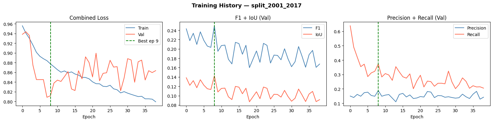
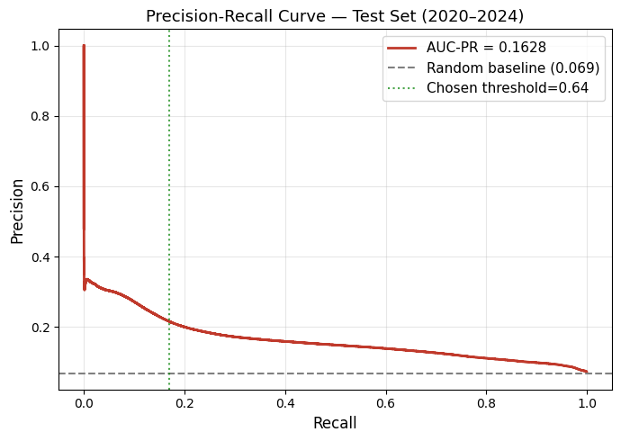
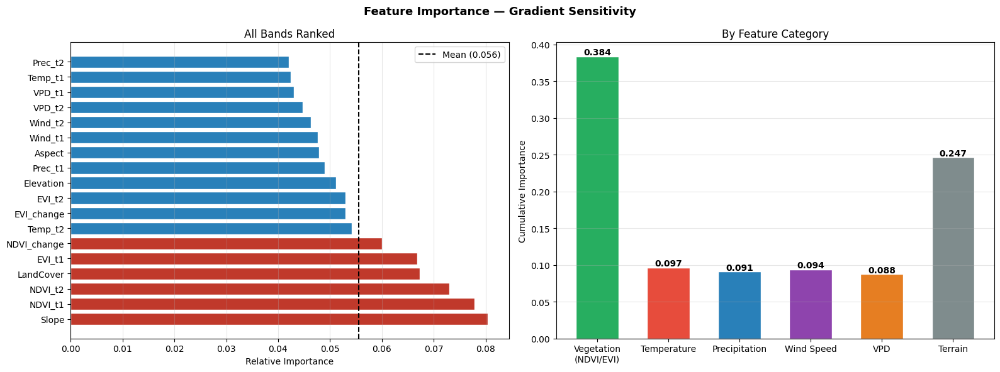

# 🔥 Short-Term Wildfire Burned Area Prediction in California Using Multi-Source Environmental Features and Deep Learning

> **Presented at:** TXST STEM Conference — Poster #36R-U  
> **Authors:** Samrakshyan Adhikari¹, Eunsang Cho²  
> ¹Department of Computer Science, ²Ingram College of Engineering, Texas State University, Texas, USA  
> 📧 Contact: nbb38@txstate.edu

---

## 📄 Research Poster

  

---

## 📌 Summary

Wildfires are increasing due to the combined effects of climate change and prolonged drought conditions, creating greater risks to ecosystems, infrastructure, and human life. This project predicts burned area extent using advanced deep learning techniques that capture spatial patterns from lagged environmental variables and indicators of vegetation stress. Labels are derived from the **MODIS Burned Area Product (MCD64A1)**, with inputs from MODIS vegetation indices and GRIDMET climate datasets. An **Attention U-Net** architecture is used to learn spatial features and improve prediction performance.

---

## ❓ Research Questions

1. How accurately can burned area extent be predicted using lagged environmental and vegetation data?
2. How well does the model generalize to unseen regions and future wildfire seasons (2020–2024)?
3. Which environmental features (e.g., NDVI, EVI, slope, climate variables) are most important for wildfire prediction?

---

## 🗺️ Study Area

California, United States — a region characterized by a Mediterranean climate with wet winters and hot, dry summers that increase wildfire risk. Study period: **2001–2024**.

---

## 🛰️ Data Sources

### Burned Area (Labels)
- **MODIS Burned Area Product (MCD64A1)** — binary burned vs. non-burned targets

### Environmental Predictors (Table 1)

| Type | Variable | Full Name | Values | Resolution | Source |
|------|----------|-----------|--------|------------|--------|
| Vegetation | NDVI | Normalized Difference Vegetation Index | Mean | 250→500m | MODIS MOD13Q1 |
| Vegetation | EVI | Enhanced Vegetation Index | Mean | 250→500m | MODIS MOD13Q1 |
| Vegetation | NDVI_change | NDVI Temporal Change | Difference (t-1 − t-2) | 250→500m | Derived |
| Vegetation | EVI_change | EVI Temporal Change | Difference (t-1 − t-2) | 250→500m | Derived |
| Climatic | Temp_t1 | Temperature (Lag 1 Month) | Monthly Mean (°C) | ~4,000m | GRIDMET |
| Climatic | Temp_t2 | Temperature (Lag 2 Months) | Monthly Mean (°C) | ~4,000m | GRIDMET |
| Climatic | Prec_t1 | Precipitation (Lag 1 Month) | Monthly Sum | ~4,000m | GRIDMET |
| Climatic | Prec_t2 | Precipitation (Lag 2 Months) | Monthly Sum | ~4,000m | GRIDMET |
| Climatic | Wind_t1 | Wind Speed (Lag 1 Month) | Monthly Mean | ~4,000m | GRIDMET |
| Climatic | Wind_t2 | Wind Speed (Lag 2 Months) | Monthly Mean | ~4,000m | GRIDMET |
| Climatic | VPD_t1 | Vapor Pressure Deficit (Lag 1 Month) | Monthly Mean | ~4,000m | GRIDMET |
| Climatic | VPD_t2 | Vapor Pressure Deficit (Lag 2 Months) | Monthly Mean | ~4,000m | GRIDMET |
| Physical | Elevation | Elevation | Static | 30m | SRTM DEM |
| Physical | Slope | Terrain Slope | Derived | 30m | SRTM DEM |
| Physical | Aspect | Terrain Aspect | Derived | 30m | SRTM DEM |
| Land Cover | Landcover | Land Cover Classification | Annual Class | 500m | MODIS MCD12Q1 |

---

### Processing Pipeline

- **16 input features**, 14 environmental bands, 500m native resolution (EPSG:5070)
- Impute NaNs: z-score normalize (train stats only)
- **Patch extraction:** 64×64 sliding window, stride 32, 3 patch categories
  - **Fire patches** — burned pixel inside; max 500 per cluster
  - **Near-fire patches** — 10px buffer; max 500 per cluster
  - **Background patches** — beyond 40px from fire; up to 100 per month
- Total: **23,716 patches** extracted

### Temporal Split (No Data Leakage)

| Split | Period | Patches | Fire Pixel % |
|-------|--------|---------|--------------|
| Train | 2001–2017 | 17,898 | 3.16% |
| Validation | 2018–2019 | — | — |
| Test | 2020–2024 | 7,038 | 6.89% |

### Class Imbalance Handling

- (2) Oversampling: 2×/3×/4× oversample fire patches
- (2) Weighted sampling: more fire patches per batch
- (3) Focal + Dice loss (α=0.75, γ=2.0)

### Attention U-Net Training

- Encoder (64–128–256), Bottleneck: 512
- Attention gates at each decoder level
- Adam optimizer, Batch: 16, Max: 150 epochs
- Early stopping patience: 30, Monitor: val F1

### Evaluation

- Metrics: F1, IoU, Precision, Recall, AUC-PR
- Threshold tuning on validation set
- Interpretability: Grad-CAM, Feature Importance, Band correlation, Attention gate visualization

---

## 📊 Results

### Result 1 — Model Training & Performance

  
   <em>Figure 4: Training Curves (split 2001–2017)</em>

  
   <em>Figure 5: Precision-Recall Curve — Test Set (2020–2024)</em>

#### Metrics (Test Set: 2020–2024)

| Metric | Value |
|--------|-------|
| F1 | 0.1896 |
| IoU | 0.1047 |
| Precision | 0.2163 |
| Recall | 0.1688 |
| AUC-PR | 0.1628 |

- Model learns general wildfire patterns but performance is moderate (F1 ≈ 0.18)
- High class imbalance affects recall and precision trade-off
- Temporal generalization to 2020–2024 remains challenging

---

### Result 2 — Feature Variable Importance

  
   <em>Figure 3: Feature Importance — Gradient Sensitivity (All Bands Ranked)</em>

**By Feature Category (Cumulative Importance):**

| Category | Importance |
|----------|------------|
| Vegetation (NDVI/EVI) | **0.384** |
| Temperature | 0.247 |
| Precipitation | 0.097 |
| VPD | 0.091 |
| Terrain | 0.094 |

- **Vegetation indices (NDVI, EVI)** are the most important predictors
- **Climate variables** (temperature, precipitation, VPD) contribute moderately
- **Terrain features** (elevation, slope) have lower influence on predictions

---

### Result 3 — Prediction Maps

  
   <em>Figure 8: Test Set Predictions 
  Model predictions on unseen wildfire data (2019–2024)</em>

- Model captures major burned regions but misses smaller fire areas (FN)
- Some false alarms (FP) occur in vegetation-dense regions
- True positives (green) indicate successful detection of fire patterns

---

## ✅ Conclusions & Limitations

- The Attention U-Net model demonstrates basic capability in learning wildfire patterns, achieving **Val F1 = 0.2495** and **Test F1 = 0.1896**
- Model performance is above random (AUC-PR = 0.1628), indicating meaningful learned relationships
- Predictions are incomplete and fragmented with a large number of missed fire pixels (high false negatives)
- The model shows low recall, limiting its ability to capture the full extent of burned areas
- Performance degrades on future wildfire seasons (2020–2024) due to **temporal distribution shift**
- Additional challenges: class imbalance and difficulty modeling complex spatial fire dynamics

---

## 🔭 Future Work

- **Advanced Loss Functions:** Focal Loss, Tversky Loss to improve recall
- **Temporal Sequence Modeling:** Replace 2-month static lagged features with **7-day temporal sequences** using **Conv-LSTM** to capture short-term fire weather dynamics
- **Transformer-Based Models:** Temporal U-Net, Transformer-based architectures for long-range spatial dependencies
- **Additional Data Sources:** Recent wildfire datasets (post-2018), drought indices, soil moisture
- **Post-Processing:** Morphological smoothing, region-growing for better fire boundary delineation

---

## 📚 References

Zhang, Q., Ge, L., Zhang, R., Metternicht, G. I., Liu, C., & Du, Z. (2021). Deep-learning-based burned area mapping using the synergy of Sentinel-1 & Sentinel-2 data. *Remote Sensing of Environment*, 264, 112575. https://www.sciencedirect.com/science/article/abs/pii/S0034425721002959

---

## 👩‍💻 Author

**Samrakshyan Adhikari**  
B.S. Computer Science (Computer Engineering), Honors Program  
Texas State University  
Portfolio: https://samrakshanadhikari.github.io/WebsitePortfolio/  
Email: samrakshanadhikari@gmail.com

---

## 📌 License

This repository is for academic & research demonstration purposes only.
